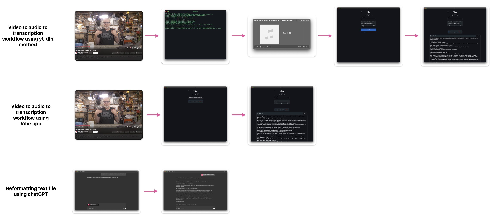
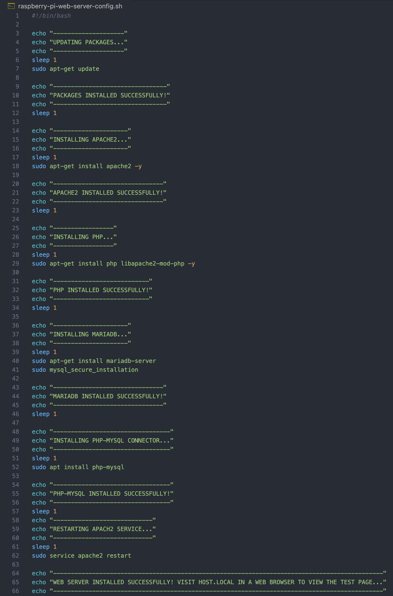

# Transcript Generator

## Background

I tend to save a lot of videos so that I can refer back to them at a later time when I'm reflecting on parts of my life. However, I'm realizing as I get older that reading content that I'm trying to absorb is more effective that passively watching or listening to it. Lately I've been trying a new technique of downloading the audio of videos, transcribing them, and then reading those transcriptions. So far this method seems to make everything "stick" more in my brain. 

## My Current Process for Downloading and Transcribing

This process has gotten significantly easier. I used to use a command line tool called [yt-dlp](https://github.com/yt-dlp/yt-dlp) which is an audio/video downloader with support for a massive amount of websites (which I have only used with YouTube so far). The following command - `yt-dlp -x --audio-format mp3 [URL]` was used to get an .mp3 file of the video. 

Instead of trying to take the time and manually transcribing the audio by hand, I used a program called [Vibe](https://thewh1teagle.github.io/vibe/) that uses whisper.cpp, a port of Open AI's speech recognition model - Whisper - "a community-driven project that focuses on making the Whisper model run efficiently on devices with lower computational resources, such as embedded systems, local machines, or platforms where a full-scale GPU-based implementation might be impractical". This program allowed me to upload an audio file and it would transcribe the audio into text in a matter of seconds. Recently, [Vibe](https://thewh1teagle.github.io/vibe/) has incorporated [yt-dlp](https://github.com/yt-dlp/yt-dlp) (at least that's my theory) directly which saves me the whole step of creating my own .mp3 file first. Now all I do is simply paste in the URL of a given video, click transcribe, and wait for the text to appear. 

The resulting text is formatted a bit oddly so I copy it all into a .txt file and upload it to chatGPT where I give a prompt to reformat into paragraphs that are easier to read.

## Why Am I Trying to Create Something That Already Exists?

Many ideas for side projects I've ended up abandoning because someone else out in the world had already done something similar, so what would be the point in doing it myself? It took me an, admittedly long time, to have this realization that even if part of my ideas have already been created, they are still worth pursuing because I can still learn and takeaway something from the process. 

Even though [Vibe](https://thewh1teagle.github.io/vibe/) does the majority of what I want, I can't seem to find a way to integrate the reformatting of text. Who knows, maybe there already is a way that I haven't discovered, but I almost don't even want to try and dig for it because then that would take away the eagerness that I have for wanting to create a tool of my own. 

## Podcasts Also?

I tend to go in and out of phases when it comes to listening to podcasts - my podcast player of choice is [Overcast](https://overcast.fm) by Marco Arment. Recently I've been accessing the transcripts of podcast episodes as a different way to absorb their content. Most of the shows I listen to offer transcripts of episodes directly on their websites and as of March of 2024, the Apple Podcasts app now offers [transcripts directly](https://www.apple.com/newsroom/2024/03/apple-introduces-transcripts-for-apple-podcasts/) within the player. However, my main problem is that neither show websites nor Apple Podcasts offer transcripts for member-only feeds. 

## My Goal

The goal for this tool is to be able to take a video URL or podcast RSS feed, download the audio using [yt-dlp](https://github.com/yt-dlp/yt-dlp) (or a modified version of it), transcribe the audio file using an AI model, and have that transcription formatted into readable text.

## Active To Do List
Feel free to check out what parts of this project that I'm currently [working on](https://github.com/users/its-ericjones/projects/6).

## Scripts
Here you can find screenshots of scripts that I've created to help automate some of the setup process for certain components. 

### Web Server Config Script for Linux (ran on local Raspberry Pi)

